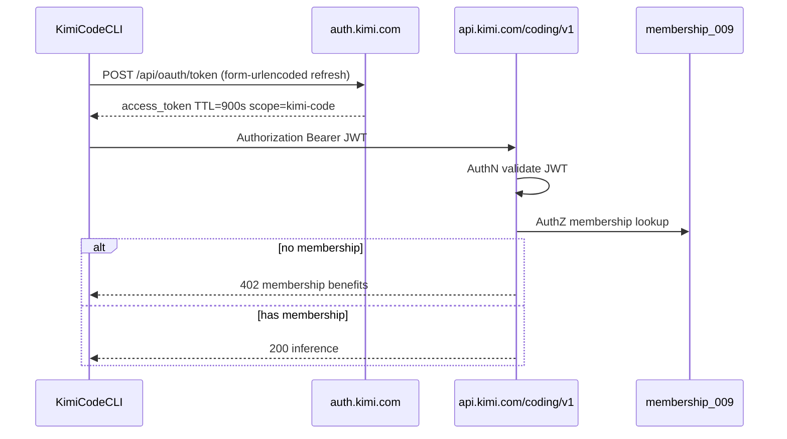

# Moonshot / Kimi Architecture Atlas

Compiled from runtime probes, open-source (`MoonshotAI/kimi-code`), and official docs.  
State at compile time: **OAuth OK, membership gate 402** (`FIX_OK_MEMBERSHIP_BLOCKED`).

## Three Product Universes

These systems are **not interchangeable**. Credentials, base URLs, and billing are separate.

| Universe | Base URL | Auth | Billing | Swarm / Claw / Code CLI stack |
|----------|----------|------|---------|-------------------------------|
| **Kimi Code** | `https://api.kimi.com/coding/v1` | OAuth JWT (`auth.kimi.com`) or **Coding Plan** API key | Membership / Vivace subscription | **Yes** — full stack |
| **Platform API** | `https://api.moonshot.ai/v1` (also `.cn`) | Platform API key (`platform.kimi.ai`) | Pay-as-you-go prepaid balance | **No** — inference only |
| **Consumer web** | `https://www.kimi.com/api/*` | Browser session cookies | Free tier / Kimi membership (web) | **No** — different product surface |

Additional paths on Code API (same OAuth):

- `https://api.kimi.com/coding/v1/search` — moonshot_search service
- `https://api.kimi.com/coding/v1/fetch` — moonshot_fetch service

OpenClaw **Coding** provider uses `https://api.kimi.com/coding/` (no `/v1`) with **anthropic-messages** API and subscription API key — same membership gate as CLI.

## Auth Flow (Kimi Code / OAuth)

### JWT claims (no entitlement in token)

| Claim | Example / role |
|-------|----------------|
| `iss` | `kimi-auth` |
| `scope` | `kimi-code` |
| `type` | `access` |
| `user_id`, `device_id` | identity binding |
| `client_id` | `17e5f671-d194-4dfb-9706-5516cb48c098` |
| `exp` | ~900s |

**No** `plan`, `credits`, or membership fields — entitlement is always **server-side** (Postgres `membership_009` per docs leak).

### OAuth refresh rules

- **Must** use `application/x-www-form-urlencoded` (JSON body → `unsupported_grant_type`)
- Token endpoint: `https://auth.kimi.com/api/oauth/token`
- No public OIDC discovery at `/.well-known/openid-configuration` (404 nginx)

## Dual AuthZ on Code API

Two separate server checks:

| HTTP | Route example | Error shape | Meaning |
|------|---------------|-------------|---------|
| **402** | `GET /models`, `POST /chat/completions` | OpenAI-style `{ error: { message, type: invalid_request_error } }` | Membership / Vivace not active |
| **403** | `GET /usages` | `{ code: permission_denied, details: [protobuf ErrorDetail] }` | Feature permission (e.g. usage API) |

Both responses include `X-Trace-Id` and Cloudflare edge (`CF-Ray`).

### Auth matrix (Code API `/models`)

| Credential | Result |
|------------|--------|
| OAuth JWT (valid) | **402** membership message |
| Fake `sk-...` Bearer | **401** API Key invalid/expired |
| Empty Bearer | **401** Invalid Authentication |
| No auth | **401** Invalid Authentication |

Platform OAuth JWT on Code API → **401** Invalid Authentication (separate credential universe).

## Code API Surface (runtime-confirmed)

### GET routes that exist

- `GET /models` → 402 without membership
- `GET /usages` → 403 without feature permission

All other probed GET paths (`/health`, `/swarm`, `/agents`, `/claw`, `/mcp`, `/billing`, …) → **404**.

### POST routes (exist; hit membership after AuthN)

- `/chat/completions`, `/search`, `/fetch`, `/feedback`, `/messages`, `/embeddings`
- `/completions`, `/moderations` → 404

**Swarm, Claw, MCP** are **CLI-local** (`AgentSwarm` tool, `/swarm` slash) — not separate public REST hosts.

## Managed Models (Vivace / Membership)

From Kimi Code CLI config (`managed:kimi-code`):

| Alias | Backend model | Context | Notes |
|-------|---------------|---------|-------|
| `kimi-code/k3` | `k3` | 1,048,576 | Default; thinking max |
| `kimi-code/k3-256k` | `k3-256k` | 262,144 | |
| `kimi-code/kimi-for-coding` | `kimi-for-coding` | 262,144 | K2.7 Code |
| `kimi-code/kimi-for-coding-highspeed` | `kimi-for-coding-highspeed` | 262,144 | K2.7 HighSpeed |

## Local Wrappers (proxy to same backend)

| Command | Role | Backend |
|---------|------|---------|
| `kimi -p` | Print mode / agent | `api.kimi.com/coding/v1` |
| `kimi web` | Local REST/WebSocket UI on loopback | Proxies to Code API → same 402 gate |
| `kimi acp` | ACP JSON-RPC for IDEs (Zed, JetBrains) | Same OAuth + membership gate |

Local `kimi web` exposes `/api/v1/*` with local bearer token; inference still requires membership on upstream.

## Platform API (pay-as-you-go)

- Docs: `https://platform.kimi.ai/docs/llms.txt`
- K3 pricing (indicative): $0.30 / $3 / $15 per 1M tokens (cache hit / miss / output)
- CLI path: `kimi` → `/login` → **Kimi Platform (API key)**
- OpenClaw path: `@openclaw/moonshot-provider` + `moonshot/kimi-k3`

Does **not** unlock AgentSwarm, Kimi Code `/swarm`, or Claw billing stack.

## Internal Components (from error-reference leaks)

| Component | Artifacts | Role |
|-----------|-----------|------|
| Postgres | `membership_009`, `kimi_chat_prod_rw` | Plan verification |
| Redis | rate limit script failures | 5h rolling, burst limits |
| Billing protobuf | `kimi.billing.v1.ClawExtension.bot_id` | Per-bot Claw billing |
| Moderation VPC | `api.msh.team/v1/moderations` @ 172.24.64.47 | Image/content mod |
| Fetch pipeline | url2text, spider checkUrl | Agent URL tools |
| gRPC gateway | invalid_argument, unavailable, … | Backend taxonomy |

## Infra Edge (summary)

| Host | Edge |
|------|------|
| `api.kimi.com`, `auth.kimi.com` | Cloudflare CDN |
| `code.kimi.com`, `open.kimi.com`, `chat.msh.team` | volcddos → 103.143.17.156 |
| `api.msh.team` | RFC1918 VPC — unreachable from internet |
| `free/trial/sandbox.*.kimi.com` | NXDOMAIN |

See [`infra-dns.json`](infra-dns.json) and [`msh-team-notes.md`](msh-team-notes.md).

## Legal Access Paths

1. **Vivace / Kimi Membership** → OAuth as today → full Code + K3 1M + Swarm + Claw
2. **Platform API key** → K3 inference pay-as-you-go via CLI or OpenClaw
3. **Consumer kimi.com** → browser chat (separate from Code CLI stack)

## References

- Master index: [`../error-matrix.json`](../error-matrix.json)
- Billing / Claw: [`billing-claw.md`](billing-claw.md)
- Protobuf: [`protobuf.md`](protobuf.md)
- Decision guide: [`decision-matrix.md`](decision-matrix.md)
